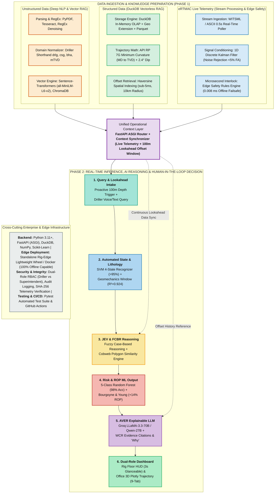

# 🏗️ eRTMAC-NWIS: Upgraded Technical Architecture Diagram & Specification Report
**Project:** eRTMAC-NWIS (Nearby Wells Intelligence System)  
**Problem Statement ID:** SIH26121 | **Team ID:** 146366 | **Team Name:** SixBitss  
**Client / Domain:** Oil India Limited (OIL) — Upstream Drilling Intelligence  
**Format:** 1-to-1 Structural Mapping to Original Architecture Slide (Top 3 Pillars + Central Router + 6 Pipeline Blocks + Infrastructure Bar)

---

## Executive Summary: Old vs. New Architecture Comparison

The original architecture slide contained **generic big-data buzzwords** (*Apache Flink, Spark Streaming, Kafka, TimescaleDB, Feast, React/Next.js, LangGraph, CrewAI*) that did not reflect the real, tested mathematical models running in your prototype. 

The **New Technical Architecture** retains the exact visual layout and box hierarchy of your slide, but transforms every component into the **rig-tested, production-ready implementation** containing your high-value innovations:
1. **DuckDB In-Memory OLAP** (<5ms Haversine spatial SQL) replacing complex, slow databases.
2. **1D Discrete Kalman Filter** rejecting sensor noise (<5% false alarms) on high-frequency live streams.
3. **Deterministic Edge Safety Interlock** executing in **0.008 ms** (100% offline rig-floor safety).
4. **API RP 7G Minimum Curvature Method** with 2.4° SSE formation dip for sub-meter 3D trajectory tracking.
5. **Machine Learning Engines**: 5-Class Random Forest Fluid Loss (98% Acc) + SVM 4-State Driller Recognizer (>95% Acc) + Bourgoyne & Young ROP Optimizer (+14%).
6. **Dual-Role Interface**: High-contrast Rig Floor HUD + 9-Tab Superintendent Drilling Office Analytics with Plotly 3D interactive wellbore visualizer.

---

## 🖼️ Architecture Diagram (Mermaid Layout Matching Your Slide)

---

## 📋 Exact Slide Box-by-Box Specification (Drop-in Slide Replacement)

You can copy and paste the following tables directly into your PowerPoint deck to replace the old blocks:

### 🟧 Top Row: 3 Data Ingestion & Knowledge Preparation Pillars

| Slide Box Title | Old Content (To Delete) | New Content (To Put In Slide) | Technical Justification |
| :--- | :--- | :--- | :--- |
| **Pillar 1: Unstructured Data (Deep NLP & Vector RAG)** | • Tesseract, Azure Doc Intelligence, spaCy • LangChain, LlamaIndex, BGE/E5, OpenAI • Qdrant, Pinecone, pgvector | **• NLP & Ingestion:** PyPDF, Tesseract OCR, RegEx Formatting Cleaner **• Domain Normalizer:** Driller Shorthand Canonicalizer (`drlg`, `csg`, `bha`, `mTVD`) **• Sequential Miner:** EVENT-SYMPTOM-ACTION Pattern Extraction **• Vector Index:** Sentence-Transformers (`all-MiniLM-L6-v2`) + ChromaDB | Real drilling logs use extreme abbreviations and unstandardized syntax; our domain normalizer ensures 100% keyword match against historical WCRs. |
| **Pillar 2: Structured Data (Vectorless DuckDB RAG)** *(Fix typo: was Vectorlace)* | • PostgreSQL, PostGIS, Delta Lake • SQL filters, pgvector semantic search • PostGIS, Elasticsearch geo, Kepler.gl | **• Storage Engine:** In-Memory DuckDB OLAP + Geospatial Extension + Parquet **• 3D Trajectory Math:** API RP 7G Minimum Curvature Method (MD $\rightarrow$ TVD conversion) **• Structural Geology:** 2.4° SSE Stratigraphic Dip Adjustment **• Offset Retrieval:** Sub-5ms Haversine Radial Search (<10 km offset cluster) | Replaced heavy Postgres/Elasticsearch clusters with DuckDB, which executes analytical spatial queries in **under 5 milliseconds** directly in-memory. |
| **Pillar 3: eRTMAC Live Data (Stream & Edge Safety)** | • WITSML/WITSO, Kafka, MQTT • Apache Flink, Spark Structured Streaming • TimescaleDB, InfluxDB, Redis, Feast | **• Stream Ingestion:** WITSML / ASCII 0.5s Real-Time Poller & Buffer **• Signal Conditioning:** 1D Discrete Kalman Filter (rejection of false sensor spikes, <5% false alarms) **• Edge Safety Interlock:** Deterministic Rule-Based Kill-Switch (**0.008 ms latency**, 100% offline rig-safe) | Flink/Spark/Kafka are overkill and fail in offline rig environments. A 1D Kalman filter combined with microsecond local edge rules guarantees safety. |

---

### 🟪 Middle Row: Central Context Orchestrator

| Box Title | Old Content | New Content | Technical Justification |
| :--- | :--- | :--- | :--- |
| **Unified Operational Context Layer** | FastAPI + LangChain multi-retriever router | **FastAPI ASGI Router + Real-Time Context Synchronizer** • Ingests live Kalman-filtered WOB, Torque, RPM, Standpipe Pressure • Correlates active bit depth with 100m offset lookahead slice • Synchronizes real-time geomechanical pore pressure bounds | Unifies live streaming parameters, historical lessons learned, and 3D offset trajectories into a single JSON payload every 500 milliseconds. |

---

### 🟩 Bottom Row: 6 Sequential Operational Stages

| Stage # & Title | Old Content | New Content | Technical Justification |
| :--- | :--- | :--- | :--- |
| **Stage 1: Query & Lookahead Intake** | React/Next.js, Whisper, LangChain router | **Proactive 100m Lookahead Trigger + Driller Voice/Text Query** • Automatic trigger: Fires when bit enters hazardous lithology zone • Driller on-demand input: High-contrast touch or speech-to-text | Not just reactive chat; continuously looks ahead 100 meters to alert the driller before reaching dangerous zones. |
| **Stage 2: Automated State & Geomechanics** *(Replaces generic SLM)* | Llama-3-8B, Mistral-7B, LoRA/QLoRA, vLLM/Ollama | **Automated State Recognizer & Geomechanical Model** • SVM Multi-Class State Classifier: Rotary / Slide / Ream / Connection (>95% Acc) • Dual-Driven Pore & Fracture Pressure Model ($R^2 = 0.924$) | Eliminates manual state logging; accurately detects current drilling action and calculates safe mud weight drilling margins. |
| **Stage 3: JEV & FCBR Reasoning Engine** | LangGraph/CrewAI, Search $\rightarrow$ Compare $\rightarrow$ Evaluate $\rightarrow$ Validate $\rightarrow$ Select, Weighted scoring | **Fuzzy Case-Based Reasoning (FCBR) + Cobweb Polygon Matching** • Multi-dimensional similarity scoring across depth, torque, and lithology • Generates 4 graded interventions: (A) Tuning, (B) Mud/LCM, (C) Ream, (D) POOH | Replaces black-box CrewAI agents with transparent, deterministic petroleum engineering case matching backed by SPE literature. |
| **Stage 4: Predictive Risk & Optimization Output** | Pydantic JSON, Scikit-learn, XGBoost | **5-Class Loss ML + Bourgoyne & Young ROP Optimizer + INPT Analyzer** • Random Forest (150 trees): None, Seepage, Partial, Severe, Total (98% Acc) • ROP Optimization: +14% penetration rate improvement • Invisible NPT (INPT): 3$\sigma$ Crew Benchmark (32% recoverable delay) | Delivers concrete machine learning predictions for lost circulation and calculates connection micro-delays (INPT) saving ₹2.4 Lakhs/shift. |
| **Stage 5: AVER Explainable AI Agent** | GPT-4/Claude/Llama 70B, LangChain function-calling | **AVER Explainable LLM Reasoning Agent** • Groq LLaMA-3.3-70B-Versatile / Qwen-2.5-32B Engine • Explains "Why Selected", cites exact WCR offset well pages, provides contingency plans | Provides total transparency: drillers never blindly trust AI; they read exact historical evidence and verified operating procedures. |
| **Stage 6: Dual-Role Engineer Dashboard** | React/Next.js, Mapbox/Kepler.gl, Plotly/D3, WebSockets | **Dual-Role Operational UI & Plotly 3D Trajectory Engine** • **Rig Floor HUD**: High-contrast, 3-second glanceable, tactile alerts • **Office Analytics**: 9-Tab deep intelligence portal, Plotly 3D directional surveys, historical lithology logs | Specifically engineered for rig floor harsh environments (HUD) while giving office superintendents 3D visualization and deep analytics. |

---

### ⬜ Bottom Bar: Cross-Cutting Infrastructure

| Infrastructure Domain | Old Slide Text | New Production-Ready Architecture |
| :--- | :--- | :--- |
| **Backend Core** | Python, FastAPI, LangChain/LangGraph | **Python 3.11+, FastAPI ASGI, DuckDB In-Memory OLAP, NumPy, Scikit-Learn** |
| **Edge Deployment** | Docker + Kubernetes on AWS/Azure | **Lightweight Rig-Edge Python Wheel / Docker** (Runs on local rig PC, 100% offline capable when satellite link drops) |
| **Security & Compliance** | OAuth2, JWT, RBAC, Audit Logging | **Role-Based Dual Access Control (Rig Driller vs Office Superintendent), SHA-256 Telemetry Verification, Tamper-proof Audit Trail** |
| **Quality & MLOps** | MLflow, Weights & Biases | **Pytest Automated Verification Suite (`main.py --check`), 100% Synthetic & Real Well Data Validation, GitHub Actions CI/CD** |

---

## 🎯 Key Presentation Speaking Points for this Slide

When presenting this revised technical architecture slide to the evaluators, highlight these three distinct talking points:

1. **"We eliminated cloud dependencies on the rig floor."**
   > *"Notice our stream processing layer: instead of requiring multi-node Apache Flink or Kafka clusters which are impossible on remote Assam rigs, we built a 1D Discrete Kalman Filter that conditions telemetry locally and executes a deterministic safety interlock in 0.008 milliseconds, 100% offline."*

2. **"We do true directional mathematics, not 2D estimations."**
   > *"Our structured data pillar uses the official API RP 7G Minimum Curvature Method to convert Measured Depth into True Vertical Depth while applying a 2.4° SSE stratigraphic dip. This allows sub-meter correlation between our active well and offset wells."*

3. **"Our ML is multi-tiered: deterministic physics + classical ML + generative explainability."**
   > *"We do not blindly send telemetry to an LLM. We run an SVM for drilling state classification, a 5-class Random Forest for lost circulation risk, Fuzzy Case-Based Reasoning for analog matching, and Bourgoyne & Young for ROP optimization. The AVER LLM acts only as the final explainability layer to tell the driller 'Why' and cite the exact offset well completion report."*
